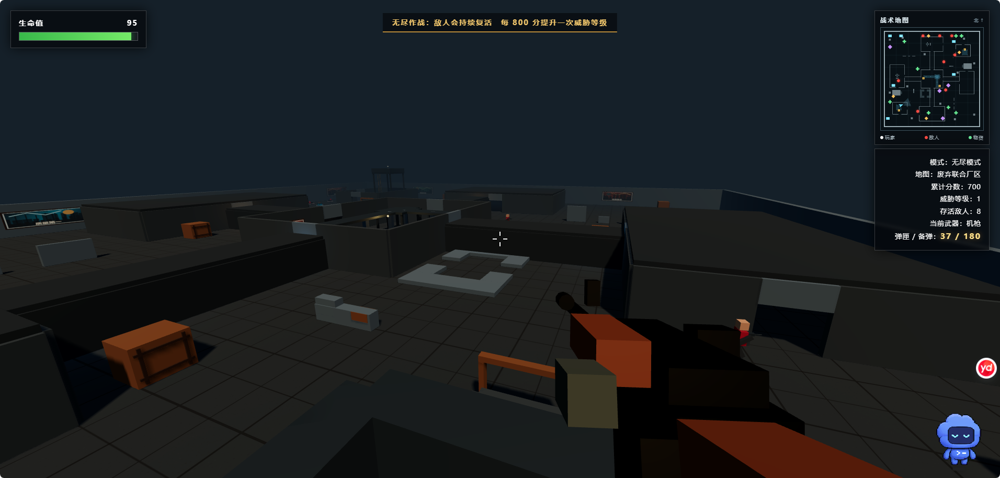

# 钢铁突围（Iron Breakout FPS）

一款使用 Three.js 制作的浏览器第一人称射击游戏。除 Three.js CDN 外，地图、角色、武器、墙画、特效和界面全部由 HTML、CSS、JavaScript 与程序几何体生成，不需要额外图片或模型素材。

## 游戏实机画面



> 从高层狙击塔俯瞰“废弃联合厂区”，右上角战术地图会实时显示玩家、敌人与补给位置。

## 游戏特色

- 无尽模式：10 张不同拓扑地图自由选择，敌人持续复活，难度随累计分数提升。
- 关卡模式：5 个逐步提升难度的关卡，每关从 10 种线路拓扑中随机抽取且同一轮不重复，每关需要消灭 25 名敌人。
- 团队模式：红蓝 5V5，可单人搭配 9 名人机，也可通过六位房间码与另一名真人联机。
- 团队规则：率先取得 100 次击杀的阵营获胜；阵亡 15 秒后复活，复活后拥有 3 秒无敌，己方免疫伤害。
- 联机识别：真人玩家拥有发光面罩和头顶“玩家”标记，手持武器会随联机状态同步。
- 十一种武器：机枪、手枪、狙击枪、匕首、火箭弹、霰弹枪、冲锋枪、半自动步枪、榴弹发射器、电击枪和轻机枪。
- 战术武器库：主菜单可查看全部武器的伤害、射程、弹匣与备弹，并拖动程序化模型进行 360° 环绕展示。
- 差异化战斗：霰弹散射、弧线榴弹、范围爆炸、电击减速、半自动扳机与百发轻机枪弹箱。
- 弹药系统：独立弹匣与备弹、手动或自动换弹、随机弹药补给。
- 敌人 AI：全地图连通巡逻、限时追击、视线检测、持枪射击与近距离伤害。
- 十种线路拓扑：废弃联合厂区、地下转运站、坍塌钢铁厂、双环冷却厂、蛇形后勤堡垒、十字机修仓、锯齿管线站、三叉铸造枢纽、回字能源堡与九宫仓储区。
- 复杂工业地图：房间、回廊、高架、梯子、暗道、台阶、掩体和高层狙击塔。
- 高空交战：每张地图设置狙击塔，玩家可以攀爬占领，塔顶也可能出现一名敌方狙击手。
- 补给系统：回血包、弹药包、随机武器物资包会不定期刷新；所有十一种武器均可在地图中发现并用 F 键交换。
- HUD：生命值、弹药、任务信息、小地图、命中与受伤反馈。
- 团队战术地图：只显示己方五名成员，不会泄露对方位置。
- 团队性能优化：AI 视线只在侦察和开枪时精确检查，静态建筑阴影只生成一次，小地图与 HUD 独立限频。
- 公平移动：团队 AI 的移动速度与玩家未按 Shift 时的步行速度一致，人机难度不再额外改变跑速。
- 无分配寻路：九名人机共用固定网格搜索缓冲区，不再在追击换路时创建整地图临时数组。
- 完整团队画质：保留原生分辨率、MSAA 抗锯齿、室内点光源、建筑阴影、补给光环和第一人称武器高优先级渲染。

## 操作方式

| 操作 | 按键 |
| --- | --- |
| 移动 | W / A / S / D |
| 瞄准视角 | 鼠标 |
| 射击 | 鼠标左键 |
| 狙击镜 | 按住鼠标右键 |
| 换弹 | R |
| 拾取并更换地面武器 | F |
| 跳跃或攀爬 | 空格 |
| 奔跑 | 左 Shift |
| 暂停/释放鼠标 | Esc |

按 Esc 后可选择“继续战斗”或“返回主菜单”；团队对局返回主菜单时会自动断开当前房间连接。

## 运行游戏

下载仓库后直接双击 `index.html`，或使用任意静态文件服务器打开。首次加载需要联网获取 Three.js CDN 脚本。

## 下载 Windows 桌面版

[前往 GitHub Releases 下载最新版](https://github.com/Louis776-glitch/iron-breakout-fps/releases/latest)

下载名称包含 `Windows-x64` 的 ZIP 压缩包，完整解压后双击 `钢铁突围.exe` 即可运行。游戏仍通过 CDN 获取 Three.js，因此启动时需要联网。当前公开版本未购买代码签名证书，Windows 首次运行时可能显示安全提示。

开发者也可以在安装 Node.js 后运行以下命令构建桌面版：

```bash
npm install
npm run package:win
```

## 团队联机

团队联机采用“公共 WebSocket 房间服务器 + 六位房间码 + 可选密码”。房主负责权威判定 AI、伤害、击杀和复活，避免两台电脑各自计算出不同结果。

本机测试：

```bash
npm install
npm run team-server
```

两个游戏客户端的“房间服务器”都填写 `ws://127.0.0.1:8787`，一人创建房间，另一人输入相同的六位房间码和密码加入。

互联网联机：将本项目部署到支持 Node.js 或 Docker 的公网主机，启动命令为 `npm run team-server`，并为服务配置 HTTPS/WSS。两名玩家在团队大厅输入同一个 `wss://……` 服务器地址即可跨网络联机。仓库中已提供 `Dockerfile`，服务健康检查地址为 `/health`。

房主可选择 10 张地图之一和“简单 / 适中 / 困难”人机；第二名玩家可自由选择同队或对立阵营。

## 项目结构

```text
iron-breakout-fps/
├─ index.html          # 页面结构与源码加载入口
├─ Dockerfile         # 团队房间服务器容器部署
├─ css/
│  └─ game.css         # HUD、菜单、瞄准镜和响应式界面样式
├─ server/
│  └─ team-server.cjs  # 双人房间、密码、大厅与游戏消息中继
└─ js/
   ├─ core.js          # 渲染环境、游戏状态、碰撞、地图基础组件
   ├─ maps.js          # 十张无尽/关卡共用地图及随机地图池
   ├─ weapons.js       # 武器、弹药、换弹和随机补给
   ├─ enemies.js       # 敌人模型、生成、巡逻、追击与射击 AI
   ├─ combat.js        # 射击、弹道、命中特效、玩家生命与移动
   ├─ team.js          # 5V5 规则、阵营 AI、复活、房间联机与状态同步
   └─ main.js          # 模式流程、输入事件和游戏主循环
```

## 技术栈

- HTML5 / CSS3 / JavaScript
- [Three.js](https://threejs.org/)
- Canvas 程序化纹理

## 许可证

本项目采用 [MIT License](LICENSE) 开源。
